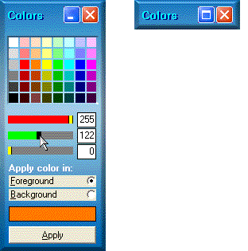



## Color Palette

### Description

This peculiar color palette can be easily added to your project.

The color can be applied on any control with ForeColor and BackColor properties.

You can pick a color from the small colored squares, adjust it with the scroll bars

(they can be moved with the navigation keys, together or not with the Shift key) or you can enter the values for Red, Green and Blue in the TextBoxs.

With no border style, the Color Palette form can be moved, maximized or minimized.
 
### More Info
 

             |
---                |---
**Submitted On**   |2002-09-21 01:13:32
**By**             |[Franco Gomes](https://github.com/Planet-Source-Code/PSCIndex/blob/master/ByAuthor/franco-gomes.md)
**Level**          |Advanced
**User Rating**    |5.0 (25 globes from 5 users)
**Compatibility**  |VB 6\.0
**Category**       |[Graphics](https://github.com/Planet-Source-Code/PSCIndex/blob/master/ByCategory/graphics__1-46.md)
**World**          |[Visual Basic](https://github.com/Planet-Source-Code/PSCIndex/blob/master/ByWorld/visual-basic.md)
**Archive File**   |[Color\_Pale1342399212002\.zip](https://github.com/Planet-Source-Code/franco-gomes-color-palette__1-39151/archive/master.zip)

### API Declarations

See code

